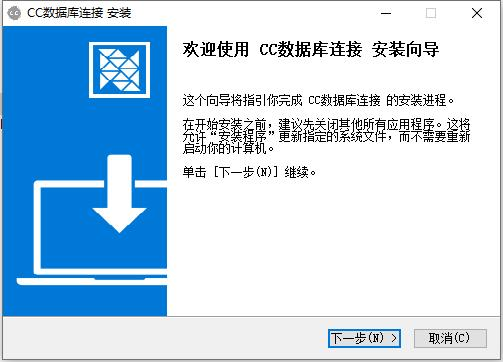
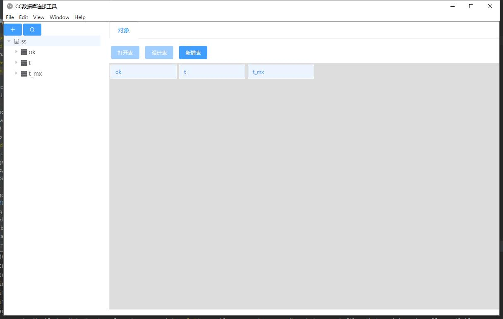
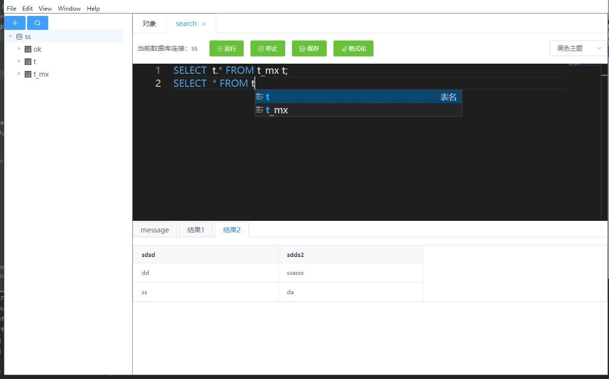
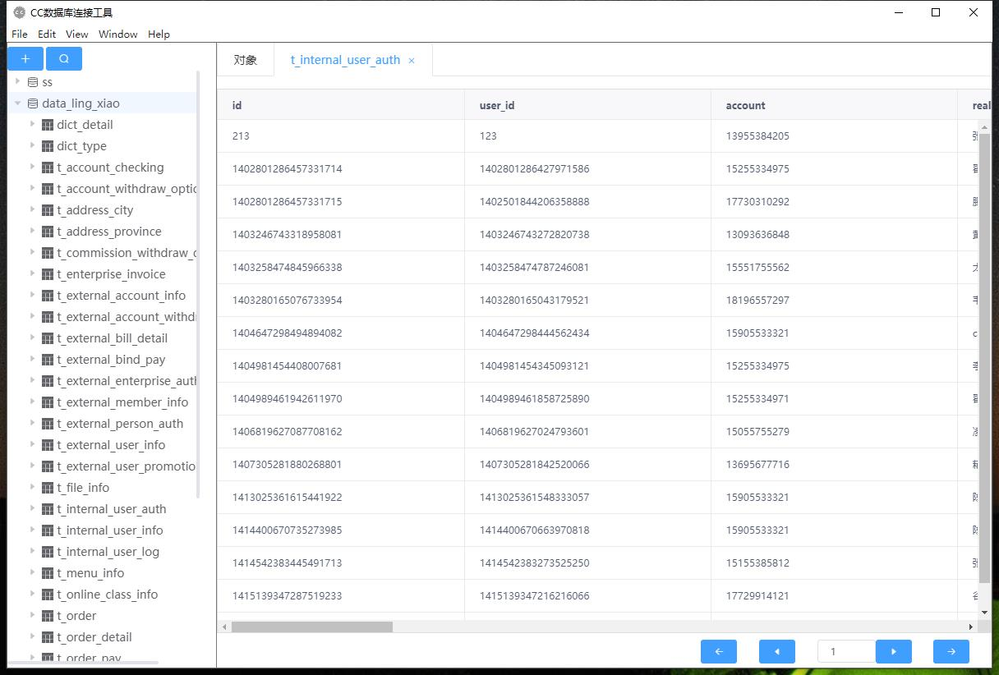

# CCDataLink

#### 介绍
CCDataLink
CC数据库连接工具 基于eletron + vue + node + ts + java

v1.0.1 预览版已发布

包含 数据库连接 数据库sql执行 关键词提示等

目前支持mysql MariaDB oracle sqlserver

其中oracle不支持多条sql同时执行

外链地址：

https://share.weiyun.com/Brn3DkOP

#### 软件架构
软件架构说明
1. 目前只能升级到electron 10   再往上升级nodejava编译不通过
2. 用户安装的时候会复制一个jdk到C盘目录
3. electron-re 子进程管理

#### 软件截图

