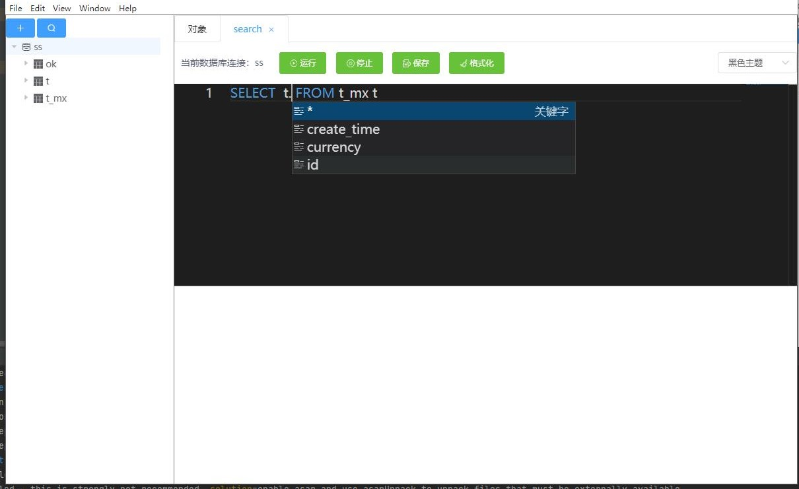

# CCDataLink

#### 介绍
CCDataLink
CC数据库连接工具 基于eletron + vue + node + ts + java

v1.0.0 预览版已发布

包含 数据库连接 数据库sql执行 关键词提示等

目前支持mysql mybatis oracle sqlserver

其中oracle不支持多条sql同时执行

外链地址：

https://njc-download.weiyun.com/ftn_handler/f395cc225996f5582d85a64dd252b80d358cb1c7a149300a71e3c323ce48fb857af46bdab612bace1764de40f11f9c6b5bfa40979a83b581b48cfb20395ecfeb/CC%E6%95%B0%E6%8D%AE%E5%BA%93%E8%BF%9E%E6%8E%A5%20Setup%201.0.0.exe?fname=CC%E6%95%B0%E6%8D%AE%E5%BA%93%E8%BF%9E%E6%8E%A5%20Setup%201.0.0.exe&from=30113&version=3.3.3.3

#### 软件架构
软件架构说明
1. 目前只能升级到electron 10   再往上升级nodejava编译不通过
2. 用户安装的时候会复制一个jdk到C盘目录
3. electron-re 子进程管理

软件截图

